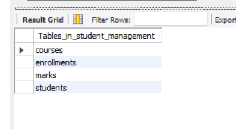
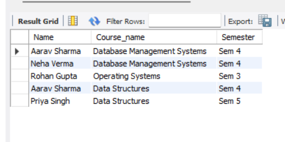
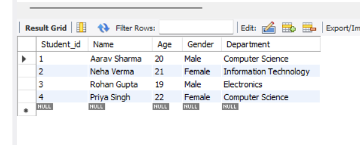
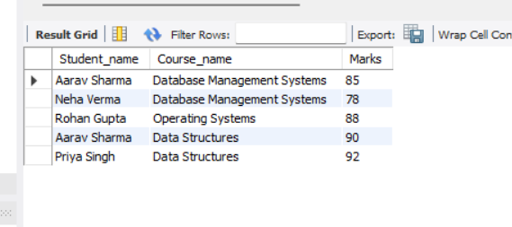
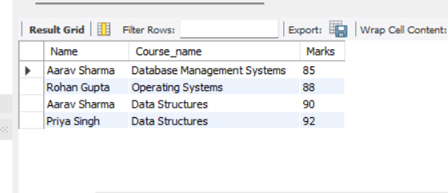

# Student Management System (SQL Project)

## 📌 Project Overview
This project demonstrates a **Student Management System** built using **MySQL**.  
It includes **database creation, table relationships, sample data, queries, views, indexes, and stored procedures**.  
The project showcases key SQL concepts: table relationships, joins, subqueries, aggregation, views, indexes, and stored procedures.

---

## 📌 Database Schema
- **Tables**: `students`, `courses`, `enrollments`, `marks`  
- **Relationships**: Foreign keys link `enrollments` and `marks` to `students` and `courses`

---

## 📌 Sample Queries
- **Basic Queries**: SELECT, WHERE, filtering  
- **JOIN Queries**: Find which student is enrolled in which course and their marks  
- **Aggregates & Subqueries**: Average marks, students above average  
- **Views & Indexes**: `Student_marks_view`, index on `marks` table  
- **Stored Procedure**: `GetTopStudents` to fetch students scoring above a given threshold  

---

## 📌 Screenshots

### Tables

### Join Queries

### Sample Query Output

### Views

### Procedures

---

## 📌 Projects (In Progress)
- **To-Do List (Python)** – **OOP & File Handling practice project**  
  Demonstrates use of **classes, objects, constructors, and methods**, with **file operations** to store tasks persistently.

- **Student Management System (SQL)** – **Mini project to showcase SQL skills**  
  Includes **database design with multiple tables** (`students`, `courses`, `enrollments`, `marks`), **data insertion**, **JOINs**, **subqueries**, **aggregate functions**, **views**, **indexes**, and **stored procedures**. Fully **portfolio-ready** with sample queries and database structure.

- *(More projects coming soon!)*

---

## 📌 GitHub
- [Student Management System Repository](https://github.com/Avika26/Student-Management-System)
